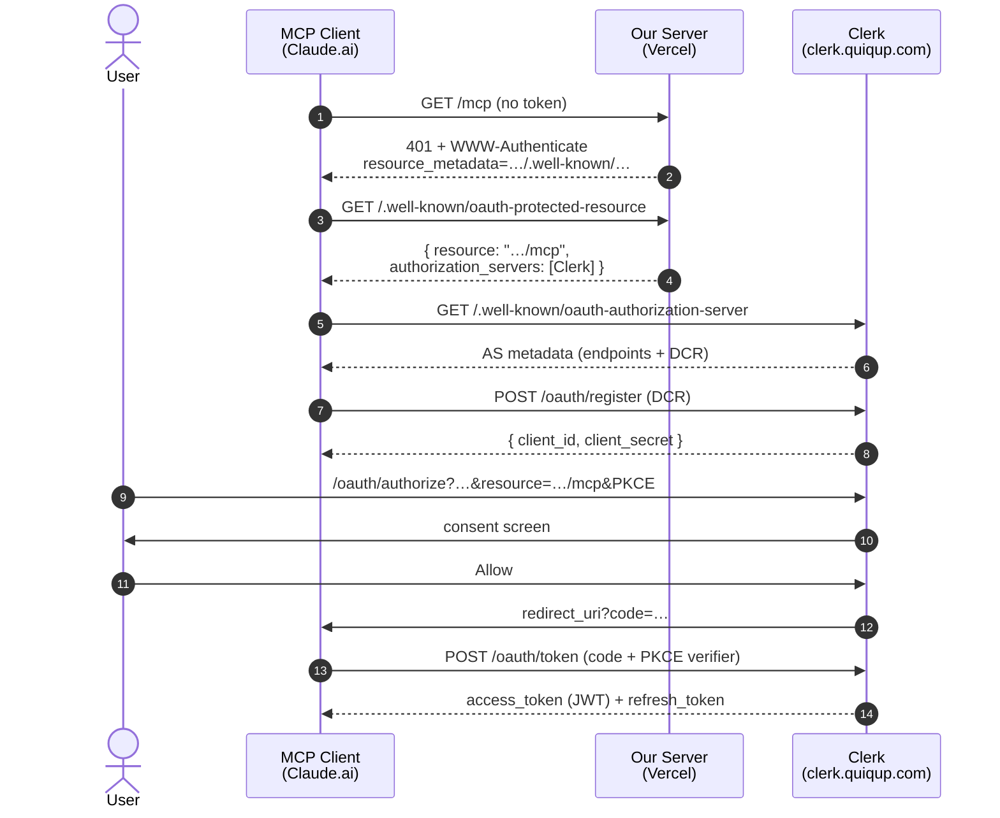
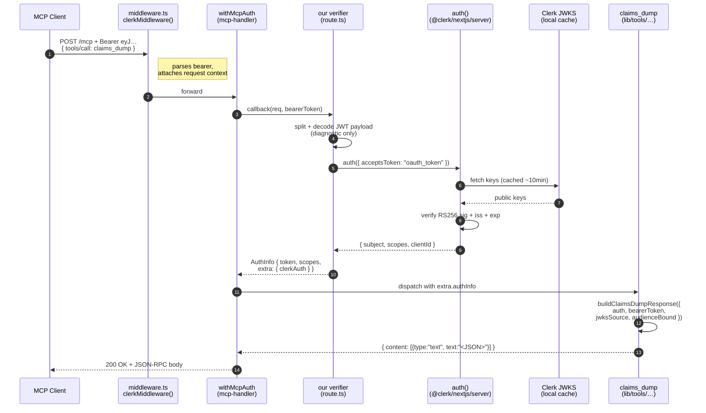

# How it works

A walkthrough of this repo's runtime, end to end. Read top to bottom once and you should be able to explain MCP-over-HTTP-with-OAuth to a teammate without re-deriving it.

## What an MCP server actually is

An MCP server is an HTTP server that speaks JSON-RPC 2.0 over POST. There is no exotic transport, no separate daemon, no special socket — it is a single endpoint that accepts a JSON envelope like `{"jsonrpc":"2.0","id":1,"method":"tools/list"}` and returns a JSON response. Method names are strings the spec defines (`tools/list`, `tools/call`, `initialize`, etc.); request and response bodies are plain JSON. You can `curl` it with a valid `Authorization: Bearer <jwt>` header and it works.

In this repo the HTTP server is Next.js. The single MCP endpoint lives at `app/[transport]/route.ts` and it exports `GET` and `POST` from the same handler (`route.ts:32`). The dynamic segment `[transport]` is a Next.js routing convention — the MCP transport adapter inside `mcp-handler` reads the segment to decide whether the request is streamable-HTTP, SSE, or plain JSON-RPC. We don't write that dispatch ourselves.

The library `mcp-handler` is what turns "incoming JSON-RPC body" into "call this tool's handler with these args." We register tools against it; it owns the wire protocol.

## What runs at startup

When `bun run dev` starts, Next.js boots a single Node process running Turbopack. Nothing MCP-specific happens yet — there's no separate MCP server, no background worker. The first request to `/mcp` lazily evaluates `app/[transport]/route.ts`, which calls `createMcpHandler` and inside the registration callback runs `registerClaimsDump(server)` (`route.ts:5-11`). That call hits `lib/tools/claims-dump.ts:48` and registers the `claims_dump` tool with the MCP server instance. From then on, every JSON-RPC `tools/call` for `claims_dump` is dispatched to the handler defined at `claims-dump.ts:55`.

That's the entire boot sequence. One Node process, one route file, one tool. No DB, no Redis, no session store.

## What happens on an unauthenticated request

Send `GET /mcp` with no `Authorization` header. The route is wrapped in `withMcpAuth` (`route.ts:13`), which inspects the request, finds no bearer token, calls our verifier with `bearerToken = undefined`, our verifier returns `undefined` (line 16), and `withMcpAuth` short-circuits to a `401 Unauthorized`. The response carries a `WWW-Authenticate` header of the form `Bearer error="invalid_token", resource_metadata="https://<host>/.well-known/oauth-protected-resource"`. That `resource_metadata` URL is configured at `route.ts:28`.

The MCP client reads that header, fetches the URL, and gets back RFC 9728 Protected Resource Metadata JSON — a small document that names the authorization server(s) the client should authenticate against. That endpoint lives at `app/.well-known/oauth-protected-resource/route.ts`. We don't hand-write the JSON; we delegate to `protectedResourceHandlerClerk` from `@clerk/mcp-tools/next`, which fills the `authorization_servers` array with the Clerk issuer it derives from our env. The same file exports an `OPTIONS` handler for CORS preflight so browser-based MCP clients can fetch it cross-origin.

### Sequence: discovery + OAuth (one-time per client install)

## What happens during OAuth (DCR + auth code)

After the 401, the client drives a full OAuth 2.1 flow against Clerk — none of this hits our server. The steps:

1. **AS discovery.** Client fetches `https://clerk.quiqup.com/.well-known/oauth-authorization-server` to learn the authorization, token, and registration endpoints.
2. **Dynamic Client Registration (RFC 7591).** Client POSTs its own metadata (redirect URIs, name) to Clerk's `/oauth/register`. Clerk creates a new OAuth Application row in the dashboard and returns a `client_id`.
3. **Authorization request.** Client opens the user's browser to Clerk's `/oauth/authorize` with PKCE-S256 (RFC 7636) and an RFC 8707 `resource` parameter pinning the eventual access token to *our* MCP URL.
4. **User authn + consent.** User signs in at `accounts.quiqup.com`, sees a consent screen listing the requested scopes, approves.
5. **Token exchange.** Client POSTs the auth code plus PKCE verifier to `/oauth/token`. Clerk returns an access token (a JWT whose `aud` claim is bound to our resource per RFC 8707) and a refresh token.

Our server's only contribution to all of this was the 401 with the `WWW-Authenticate` header and the PRM JSON. The client and Clerk do the rest.

## What happens on an authenticated tool call

Now the client retries `POST /mcp` with `Authorization: Bearer <jwt>` and a body like `{"jsonrpc":"2.0","id":2,"method":"tools/call","params":{"name":"claims_dump","arguments":{}}}`.

The request first hits `middleware.ts` at the repo root. That file runs `clerkMiddleware()` from `@clerk/nextjs/server` on every matching route, which parses the bearer and attaches per-request context that `auth()` will later read. **Without this file, `auth()` throws** — it has no context to verify against. The matcher in `middleware.ts` explicitly includes `/.well-known/*` so PRM requests also benefit, even though they don't strictly need it.

Once middleware completes, `withMcpAuth` extracts the bearer and invokes our verifier (`route.ts:15-25`). The verifier calls `auth({ acceptsToken: "oauth_token" })` from `@clerk/nextjs/server`. That call reads the request context the middleware prepared, verifies the JWT signature against Clerk's JWKS (cached locally inside `@clerk/nextjs`), checks issuer + expiry, and returns a `MachineAuthObject` whose `.subject` is the Clerk user ID. We package that into the `AuthInfo` shape `mcp-handler` expects, stashing the full Clerk auth object in `extra.clerkAuth` so the tool can read it.

> Note on `aud`: the MCP spec and RFC 8707 *describe* tokens whose `aud` claim is bound to the resource URL the client requested. Empirically, on the Quiqup Clerk tenant, OAuth access tokens come back with `aud: undefined` even when the client sent a `resource=` parameter and "Resource Indicators" is enabled in the dashboard. `auth({ acceptsToken: "oauth_token" })` accepts the token anyway, so this doesn't break authentication — but it does mean we can't rely on `aud` for resource-scoped routing if we ever shard one Clerk tenant across multiple MCP servers. Tracked as an open question.

`mcp-handler` then dispatches to the registered `claims_dump` handler at `claims-dump.ts:55`. The handler reads `extra.authInfo.extra.clerkAuth` for the verified claims, reads `extra.authInfo.token` for the raw bearer (so it can base64-decode the JWT for diagnostic display), calls `buildClaimsDumpResponse` (line 79), and returns a single MCP text content block containing pretty-printed JSON with `authObject`, `decodedJwt`, and `serverNotes`.

The hot path is all local crypto. No DB, no session table, no round-trip to Clerk's Backend SDK. Signature verification + claim extraction, then format and return.

### Sequence: authenticated tool call (every request)

**The layering insight worth chunking.** Two layers of "auth before code" run before our tool handler: Next.js `clerkMiddleware()` does request-level setup, then `withMcpAuth`'s verifier does MCP-protocol-level validation. Each layer prepares state the next one consumes. When middleware was missing, `auth()` couldn't find its expected request context and threw — the layer below was failing because the layer above hadn't run.

## File-by-file

- `middleware.ts` — runs `clerkMiddleware()` on every request that matches the configured matcher (everything except Next.js internals and static assets). Required for `auth()` to work in route handlers. Without this file, `auth()` throws `"Clerk: auth() was called but Clerk can't detect usage of clerkMiddleware()"` — that is the single most common Clerk-on-Next.js setup mistake.
- `app/[transport]/route.ts` — wires `createMcpHandler` + `withMcpAuth` from `mcp-handler` and the Clerk verifier from `@clerk/nextjs/server`. Exports `GET` and `POST`.
- `app/.well-known/oauth-protected-resource/route.ts` — RFC 9728 PRM via `generateClerkProtectedResourceMetadata` from `@clerk/mcp-tools/server`. We pass an explicit `resourceUrl` of `${NEXT_PUBLIC_APP_URL}/mcp` because the higher-level `protectedResourceHandlerClerk` derives the resource from the request URL — which loses the `/mcp` path component (the request hits `/.well-known/...`, not `/mcp`). Per MCP authorization spec the resource MUST be the full canonical URL of the MCP endpoint. Exports `GET` (the metadata) and `OPTIONS` (CORS preflight).
- `lib/auth.ts` — `getClerkIssuerUrl()` derives the issuer URL from `CLERK_ISSUER_URL` or by base64-decoding `NEXT_PUBLIC_CLERK_PUBLISHABLE_KEY` (the `pk_live_<base64>` format Clerk ships). Used to build the JWKS URL surfaced in `claims_dump`'s `serverNotes.jwksSource`.
- `lib/tools/claims-dump.ts` — `registerClaimsDump(server)` registers the tool against the MCP server. `buildClaimsDumpResponse` is the pure helper that formats the JSON body. Tool takes no args; returns `{ authObject, decodedJwt, serverNotes }`.

## Why orgId is null in the response

The load-bearing finding for future-Slava: OAuth access tokens minted by Clerk do **not** carry `org_id` claims. Custom JWT templates (the "default" template configured in `quiqup-platform`) only apply to **session JWTs**, not to OAuth access tokens. So `auth({ acceptsToken: "oauth_token" }).orgId` is always `null` for any token that came through the MCP OAuth flow, regardless of dashboard configuration.

Confirmed empirically by reading `quiqupltd/datacube`'s `clerk.ts`, which calls `clerk.users.getOrganizationMembershipList({ userId })` on every request precisely because it can't get org membership from the JWT. We deliberately skip that Backend SDK call here because v0 is a debug surface, not a gated resource. When a real tool needs org-gating, that's the call to add.

## Limitations and what's deferred

No business gate yet — `claims_dump` is open to any authenticated Clerk user. Authz is an M5+ concern. DCR proliferation is a known property of this design: every new MCP-client install creates a new OAuth Application row in the Clerk dashboard. At Quiqup-employee scale this is fine; at merchant scale it's an open question tracked separately.

The Layer 2 integration test uses Clerk's `testingTokens.createTestingToken()`, which returns a session-shaped token, not an OAuth access token. So that test verifies wiring and dispatch but not the full OAuth flow. Phase 7 (manual install in Claude.ai, click through the consent screen, watch the tool call land) is the real end-to-end validation.

## Quick reference: protocols cited

- **RFC 9728** — OAuth 2.0 Protected Resource Metadata (the `.well-known/oauth-protected-resource` endpoint).
- **RFC 7591** — OAuth 2.0 Dynamic Client Registration.
- **RFC 8707** — Resource Indicators for OAuth 2.0 (binds JWT `aud` to a specific MCP resource URL).
- **RFC 7636** — PKCE, S256 method.
- **MCP authorization spec (2025-06-18)** — protocol convention layered on top of OAuth 2.1, defines how MCP clients discover and use the above.
